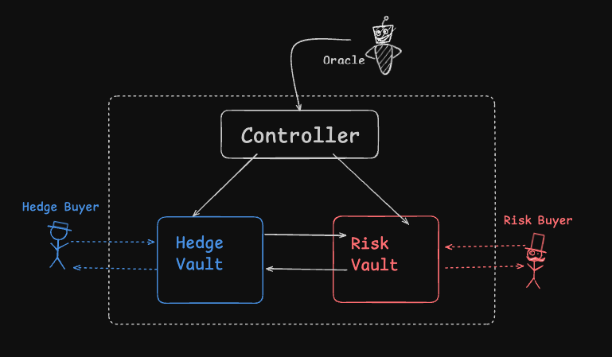

# Sentinel Protocol

A fully on-chain, parametric flight delay insurance protocol on Avalanche C-Chain.

Travelers pay a fixed USDC premium to insure a specific flight. If the flight is delayed or cancelled, they receive a fixed USDC payout — automatically, with no claim forms and no manual review. Capital is provided by underwriters who deposit USDC into a shared vault and earn yield from premiums on flights that land on time.

The entire system runs autonomously via a single [Chainlink CRE](specs/integrations/chainlink_integration.md) workflow deployed to a decentralised oracle network. There is no centralised server, no cron job, and no private key required in production.

> **CRE Early Access:** CRE workflow deployment is currently in Early Access. The platform is live and in institutional use, but the developer-facing SDK and tooling are still evolving.

---
## Overview 




## Participants

| Participant | Role |
|---|---|
| **Traveler** | Pays a fixed USDC premium, calls `claim()` on FlightPool for a payout if delayed |
| **Underwriter** | Deposits USDC into RiskVault, earns yield from on-time flight premiums, redeems shares to withdraw |
| **Owner / Admin** | Approves insurable routes via GovernanceModule, sets premium and payoff terms per route |
| **CRE Workflow** | Fires every 10 min, fetches flight status from AeroAPI, writes OracleAggregator, calls `checkAndSettle()` |

---

## Contracts

| Contract | Purpose |
|---|---|
| **GovernanceModule** | Route approval, premium/payoff terms, admin whitelist |
| **RiskVault** | Underwriter USDC pool — shares, locked capital, FIFO withdrawal queue, share price history |
| **FlightPool** | One per flight+date, lazily deployed — holds traveler premiums, settles on-time or delayed |
| **Controller** | Orchestrator — validates routes, deploys pools, enforces solvency, runs settlement loop |
| **OracleAggregator** | On-chain flight status registry — written by CRE workflow, read by Controller |
| **RecoveryPool** | Holds expired unclaimed traveler payouts for manual resolution |

Full contract design, data flows, and access control: [specs/architecture.md](specs/architecture.md)

Chainlink CRE workflow design and deployment: [specs/integrations/chainlink_integration.md](specs/integrations/chainlink_integration.md)

---

## Key Properties

- **Fully collateralised** — vault always holds 100% of worst-case simultaneous payouts
- **Pull-based** — travelers call `claim()`, underwriters call `collect()`
- **Immutable pool terms** — existing buyers never retroactively affected by route term updates
- **No centralised operator** — CRE workflow on a decentralised DON handles all scheduling, fetching, and writes
- **Single workflow** — one TypeScript file replaces FunctionsConsumer, Automation upkeep, forwarder wiring, and DON secrets upload

---

## Testing

### Forge tests (Solidity)

All forge commands run from inside `contracts/`.

```bash
cd contracts

# Run the full test suite (209 tests across 6 contracts + integration)
forge test

# Run with gas reporting
forge test --gas-report

# Run a specific test file
forge test --match-path test/Integration.t.sol

# Run a specific test by name
forge test --match-test test_buyInsurance_success -vvvv
```

### CRE workflow unit tests

Tests for the AeroAPI response parser (`parseFlightUpdate`) run against the mock fixtures in `mock_aero_api/`. No CRE CLI or network connection required.

```bash
cd cre
npm install   # first time only
npm test
```

All 10 cases should pass: `ontime-landed`, `delayed-landed`, `cancelled-weather`, `cancelled-mechanical`, `cancelled-unknown`, `inflight-ontime`, `inflight-delayed`, `landed-fallback-runway`, `empty`.

### CRE workflow local simulation

End-to-end test of the full workflow tick against a local Anvil fork. Requires the [CRE CLI](https://docs.chain.link/cre/getting-started/overview) and an [AeroAPI key](https://flightaware.com/commercial/aeroapi/).

**1. Start an Anvil fork of Fuji**

```bash
anvil --fork-url $AVAX_FUJI_RPC
```

**2. Deploy contracts to the local fork**

```bash
cd contracts
forge script script/Deploy.s.sol:DeployScript \
  --rpc-url http://127.0.0.1:8545 \
  --broadcast \
  -vvvv
```

Note the logged contract addresses.

**3. Update `cre/src/config.ts`** with the deployed addresses and `RPC_URL = "http://127.0.0.1:8545"`.

**4. Run a first simulation pass to get the simulated signer address**

```bash
cd cre
cre workflow simulate --target local --trigger-index 0
```

Read the simulated signer address from the output (labelled something like `workflow signer` or `forwarder`).

**5. Wire the local fork**

```bash
cast send $ORACLE_AGGREGATOR_ADDRESS \
  "setOracle(address)" $SIMULATED_SIGNER \
  --rpc-url http://127.0.0.1:8545 --private-key $PRIVATE_KEY

cast send $CONTROLLER_ADDRESS \
  "setCreWorkflow(address)" $SIMULATED_SIGNER \
  --rpc-url http://127.0.0.1:8545 --private-key $PRIVATE_KEY
```

**6. Seed the fork** (approve a route, deposit USDC as underwriter, buy insurance as traveler)

```bash
# Approve a route
cast send $GOVERNANCE_ADDRESS \
  "approveRoute(string,string,string,uint256,uint256)" \
  "AA123" "DEN" "SEA" 12000000 150000000 \
  --rpc-url http://127.0.0.1:8545 --private-key $PRIVATE_KEY

# Confirm one active flight is registered
cast call $ORACLE_AGGREGATOR_ADDRESS "activeFlightCount()(uint256)" \
  --rpc-url http://127.0.0.1:8545
```

**7. Set the AeroAPI secret**

```bash
cre secrets set AEROAPI_KEY --value "your-aeroapi-key"
# or: export AEROAPI_KEY=your-aeroapi-key
```

**8. Run the full simulation**

```bash
cre workflow simulate --target local --trigger-index 0
```

Expected output: workflow reads active flights, fetches AeroAPI, writes status updates to OracleAggregator, calls `checkAndSettle()`, calls `snapshot()`. Check `[USER LOG]` lines for per-flight results.

**9. Build the WASM artifact**

```bash
cre workflow build
# produces: cre/dist/workflow.wasm
```

---

## Deployment

All forge commands run from inside `contracts/`. Network config and Routescan verifier are already in `foundry.toml`.

### Prerequisites

```bash
cp contracts/.env.example contracts/.env
# Fill in PRIVATE_KEY, SNOWTRACE_API_KEY
# AVAX_FUJI_RPC defaults to https://api.avax-test.network/ext/bc/C/rpc
```

### Step 1 — Build & test

```bash
cd contracts
forge build
forge test
```

### Step 2 — Deploy all contracts (Fuji)

```bash
forge script script/Deploy.s.sol:DeployScript \
  --rpc-url avax_fuji \
  --chain-id 43113 \
  --broadcast \
  --verify \
  --verifier etherscan \
  --verifier-url https://api.routescan.io/v2/network/testnet/evm/43113/etherscan \
  --etherscan-api-key $SNOWTRACE_API_KEY \
  -vvvv
```

> Add `--slow` if you see nonce errors. The script deploys and wires in a single broadcast — no manual steps needed for the Solidity side.

The script deploys in this order and wires automatically:

| # | Action | Notes |
|---|---|---|
| 1 | Deploy `MockUSDC` | testnet stand-in for real USDC |
| 2 | Deploy `GovernanceModule` | owner = deployer |
| 3 | Deploy `RecoveryPool` | depends on USDC |
| 4 | Deploy `OracleAggregator` | no deps at deploy time |
| 5 | Deploy `RiskVault` | `controller = address(0)` placeholder |
| 6 | Deploy `Controller` | depends on all above |
| 7 | `OracleAggregator.setController(controller)` | one-time, locks forever |
| 8 | `RiskVault.setController(controller)` | one-time, locks forever |

Copy the logged addresses into your `.env` as `ORACLE_AGGREGATOR_ADDRESS` and `CONTROLLER_ADDRESS`.

### Step 3 — Approve routes (cast)

```bash
cast send $GOVERNANCE_ADDRESS \
  "approveRoute(string,string,string,uint256,uint256)" \
  "AA123" "DEN" "SEA" 12000000 150000000 \
  --rpc-url avax_fuji --private-key $PRIVATE_KEY
```

Amounts are in USDC units (6 decimals): `12000000` = $12 premium, `150000000` = $150 payoff.

### Step 4 — Wire CRE workflow (after Phase 11)

Once the CRE workflow is deployed and its forwarder address is known:

```bash
# Add to .env:
# CRE_WORKFLOW_ADDRESS=<forwarder from `cre workflow info <id>`>

forge script script/WireCRE.s.sol:WireCREScript \
  --rpc-url avax_fuji \
  --chain-id 43113 \
  --broadcast \
  -vvvv
```

This calls `OracleAggregator.setOracle(cre)` (one-time, locks forever) and `Controller.setCreWorkflow(cre)` (owner-updatable). After this the system is fully operational.

---

## File Structure

```
sentinel_protocol_avax/
│
├── contracts/                    # Solidity — Foundry project root
│   ├── src/                      # Contract source files (phases 1–7)
│   ├── test/                     # Forge tests (phases 1–8)
│   ├── script/
│   │   ├── Deploy.s.sol          # Deploy all 6 contracts + Solidity wiring
│   │   └── WireCRE.s.sol         # Post-CRE wiring (setOracle + setCreWorkflow)
│   ├── lib/
│   │   ├── forge-std/
│   │   └── openzeppelin-contracts/
│   ├── foundry.toml              # Avalanche config, OZ remapping, Routescan verifier
│   └── .env.example              # Env var template
│
├── frontend/                     # Next.js frontend (phase 13–14)
│   └── README.md                 # Placeholder — scaffolded in phase 13
│
├── specs/
│   ├── architecture.md           # Detailed contract architecture and data flows
│   ├── development_list.md       # Phase-by-phase build checklist
│   ├── progress.md               # Current phase and status dashboard
│   ├── workflow.md               # Dev workflow reference (/plan-phase, /start-phase, etc.)
│   ├── integrations/
│   │   └── chainlink_integration.md  # CRE workflow design and deployment
│   └── phases/                   # Per-phase plan and work log files
│
└── docs/
    ├── aero_api.md               # AeroAPI (FlightAware) reference
    ├── avalanche.md              # Avalanche C-Chain deployment and verification reference
    └── chainlink-cre.md          # Chainlink CRE platform reference
```

---

## Tech Stack

| Layer | Tech |
|---|---|
| Smart contracts | Solidity 0.8.20, Foundry |
| Oracle / automation | Chainlink CRE (TypeScript → WASM, deployed to Workflow DON) |
| Flight data | FlightAware AeroAPI |
| Token | USDC (6 decimals) |
| Frontend | Next.js, wagmi, viem, Reown AppKit |
| Network | Avalanche C-Chain (Fuji testnet → mainnet) |

---

## Build Progress

See [specs/progress.md](specs/progress.md) for current phase and status.

| Phase | Name |
|---|---|
| 0 | Foundry Project Init |
| 1–7 | Contracts (MockUSDC → Controller) |
| 8 | Integration Tests |
| 9–11 | CRE Workflow (Mock → AeroAPI) |
| 12 | Testnet Deployment |
| 13–14 | Frontend |
| 15 | Mainnet |
